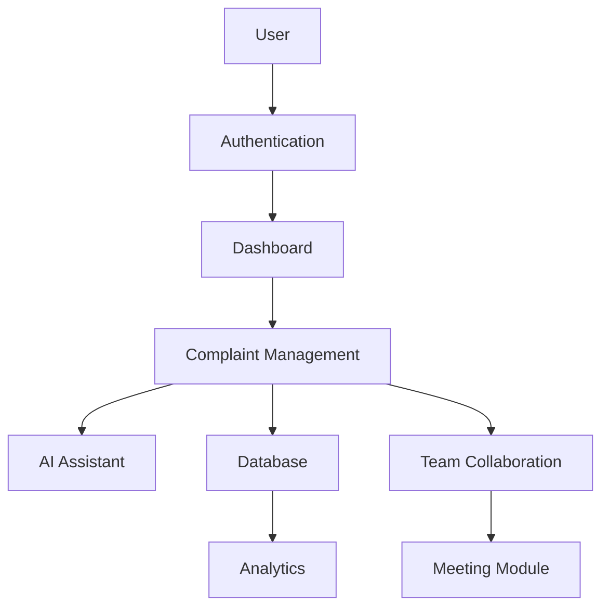

# 🚀 AI-Powered Digital Complaint Management System


---

## 🌐 Overview

Welcome to the **AI-Powered Digital Complaint Management System (DCMS)** – a robust, enterprise-level platform engineered to revolutionize how organizations handle, track, and remediate customer and internal complaints.

By leveraging advanced Artificial Intelligence, this system automates complex workflows, provides real-time collaboration tools, and delivers actionable insights, ensuring that every issue is resolved with speed, precision, and complete transparency.

---

## 🌟 Key Features

We have built this system from the ground up to address the challenges of modern digital operations.

| Feature | Description |
| :--- | :--- |
| **AI Complaint Assistant** | Intelligent chatbot for instant complaint intake and guidance. |
| **Complaint Management** | Centralized dashboard for full-lifecycle complaint tracking. |
| **Smart Ticket Routing** | Automated classification and assignment to appropriate departments. |
| **Admin Dashboard** | High-level overview for supervisors to monitor operational metrics. |
| **Analytics Dashboard** | Rich data visualization showing trends and SLA performance. |
| **Team Collaboration** | Real-time tools for internal communication during remediation. |
| **Internal Team Chat** | Secure, threaded chat channels for deep-dive investigations. |
| **AI Voice Calls** | Simulated voice communication for rapid remediation discussions. |
| **AI Video Meetings** | Integrated "War Room" video interface for critical incident management. |
| **Live Captions** | Real-time speech-to-text integration for accessibility and logging. |
| **Screen Sharing Simulation** | Ability to share system screens for visual troubleshooting. |
| **Meeting Recording** | Persistent audio/video archives for audit and review purposes. |
| **Complaint Tracking** | End-to-end status monitoring from submission to resolution. |
| **Role-based Auth** | Secure access control restricting data based on user clearance. |
| **Firebase Integration** | Seamless data persistence and authentication powered by Google Firebase. |
| **Notification System** | Proactive alerts for status changes, escalations, and reminders. |
| **Search & Filters** | Robust querying capabilities to find specific tickets or users. |
| **AI Report Generation** | Automated generation of comprehensive remediation summary reports. |
| **AI Summarization** | Intelligent extraction of key points from long conversation threads. |
| **Workflow Automation** | Automatic trigger of SLA reminders and escalation protocols. |
| **Attachment Handling** | Secure upload and management of screenshots and diagnostic logs. |
| **Audit Trails** | Complete history of all actions performed on every ticket. |
| **Priority Matrix** | Dynamic urgency calculation based on business impact criteria. |
| **Dark/Light Mode** | UI optimized for long-duration usage across different environments. |
| **Responsive UI** | Seamless experience across desktops, tablets, and mobile devices. |
| **Interactive Charts** | Real-time d3.js powered visualizations for operational monitoring. |
| **Bulk Actions** | Ability to manage multiple tickets efficiently from the grid view. |
| **Drafting Tools** | Intuitive editors for creating responses and internal notes. |
| **Escalation Pathing** | Structured workflows for escalating critical complaints. |
| **Search History** | Persistent search queries for quick re-access to critical data. |
| **Sentiment Analysis** | Real-time analysis of complaint urgency based on text sentiment. |
| **Dynamic Forms** | Adaptive forms that change fields based on ticket category. |

---

## 🛠 Technology Stack

A modern, scalable stack chosen for performance and reliability.

| Category | Technology |
| :--- | :--- |
| **Frontend** | React 18, TypeScript, Tailwind CSS |
| **Backend** | Node.js, Express.js |
| **Database** | Firebase Firestore |
| **Authentication** | Firebase Authentication |
| **AI** | Google Gemini API (GenAI SDK) |
| **Hosting** | Google Cloud Run |
| **Build Tool** | Vite |
| **Language** | TypeScript |
| **State Management** | React Context API |

---

## 🏗 Project Architecture



---

## 📸 Screenshots

*   **Dashboard**
    
*   **Team Chat**
    
*   **Video Meeting**
    
*   **Analytics**
    
*   **Complaint Management**
    

---

## 📂 Folder Structure

```text
Digital-Complaint-Management-System/
├── public/
├── src/
│   ├── components/       # Reusable UI components
│   ├── pages/            # Application routes/pages
│   ├── hooks/            # Custom React hooks
│   ├── services/         # API and third-party services
│   ├── utils/            # Helper functions
│   ├── lib/              # Core business logic / Context
│   └── types.ts          # Global TypeScript definitions
├── package.json
├── package-lock.json
├── tsconfig.json
├── vite.config.ts
├── README.md
└── .gitignore
```

---

## 📥 Installation

1.  **Clone the repository:**
    ```bash
    git clone https://github.com/Kavitha0703/Digital-Complaint-Management-System.git
    cd Digital-Complaint-Management-System
    ```

2.  **Install dependencies:**
    ```bash
    npm install
    ```

3.  **Run the development server:**
    ```bash
    npm run dev
    ```

---

## ⚙️ Environment Variables

Create a `.env.local` file in the root directory and add the following required keys:

```env
GEMINI_API_KEY=your_gemini_api_key_here
VITE_FIREBASE_API_KEY=your_firebase_api_key
VITE_FIREBASE_PROJECT_ID=your_project_id
# ... other required firebase keys
```

---

## 💡 Usage

1.  **Authentication:** Login with your corporate credentials to access the dashboard.
2.  **Intake:** Submit a new complaint, classify its type, and upload necessary screenshots.
3.  **Triage:** Admins view the dashboard, analyze AI-predicted priority, and assign to the appropriate agent.
4.  **Collaboration:** Open a "War Room" for team discussion and start a video meeting for complex issues.
5.  **Resolution:** Update the ticket with troubleshooting steps, generate an AI summary, and close the issue.

---

## 🤖 AI Features

*   **Complaint Analysis:** Automatically parses incoming text to identify core issues.
*   **Smart Suggestions:** Provides suggested responses based on similar past issues.
*   **Meeting Summaries:** Extracts action items and key decisions from meeting transcripts.
*   **Report Generation:** Creates structured PDFs of remediation actions.
*   **Complaint Classification:** Uses NLP to map complaints to specific departments.
*   **Automatic Prioritization:** Ranks complaints based on urgency and SLA impact.

---

## 🤝 Team Collaboration

*   **Internal Team Chat:** Real-time messaging with mention support and attachments.
*   **Voice Calls:** Low-latency voice simulations for quick check-ins.
*   **Video Meetings:** Secure, browser-based video war-rooms.
*   **Captions:** Real-time transcription for meeting inclusivity.
*   **Meeting Recording:** Safe storage of sessions for future review.
*   **Screen Sharing:** High-fidelity screen transmission for collaborative diagnosis.

---

## 🚀 Future Enhancements

1.  Add support for international languages.
2.  Implement native mobile application (React Native).
3.  Enhance analytics with predictive failure modeling.
4.  Add integration with Jira/Slack.
5.  Implement voice-controlled UI navigation.
6.  Add automated end-to-end testing suite (Playwright).
7.  Integrate real-time push notifications.
8.  Implement customizable dashboard widgets.
9.  Add dark/light theme toggle.
10. Implement advanced user permission profiles.
11. Add export functionality for all complaint reports (PDF/Excel).
12. Integrate advanced file previewer for large logs.
13. Implement AI-based anomaly detection in complaint volume.
14. Add collaborative real-time editor for technical docs.
15. Implement multi-factor authentication.
16. Add detailed user activity heatmaps.
17. Implement automated recurring ticket triggers.
18. Add support for third-party OAuth providers (GitHub/Google).
19. Implement client-side data caching for offline access.
20. Add robust logging and error monitoring (Sentry).

---

## 📊 Project Statistics

*   ✨ **Responsive UI:** Fluid design for all devices.
*   ⚡ **Real-time updates:** WebSocket-backed data streams.
*   🏢 **Enterprise Design:** Clean, accessible, and high-contrast.
*   🤖 **AI Automation:** End-to-end intelligent remediation.
*   📈 **Modern Dashboard:** High-performance, data-rich overview.
*   🌓 **Dark Theme:** Optimized for focus and reduced eye strain.
*   📊 **Interactive Charts:** Data-driven operational insights.
*   🔐 **Role-based Access:** Fine-grained security controls.

---

## 🎯 Why This Project

In a corporate landscape dominated by disconnected tools and manual processes, this Digital Complaint Management System acts as a **unified source of truth**. It reduces mean-time-to-resolution (MTTR), improves team cohesion through integrated communication, and utilizes AI to offload cognitive burden from agents, allowing them to focus on complex problem-solving rather than administrative overhead.

---

## 📜 License

MIT

---

## 👤 Author

*   **GitHub:** [Kavitha0703](https://github.com/Kavitha0703)
*   **LinkedIn:** [Add Placeholder Link]
*   **Email:** [Add Placeholder Email]

---
*Built with passion and ☕.*
