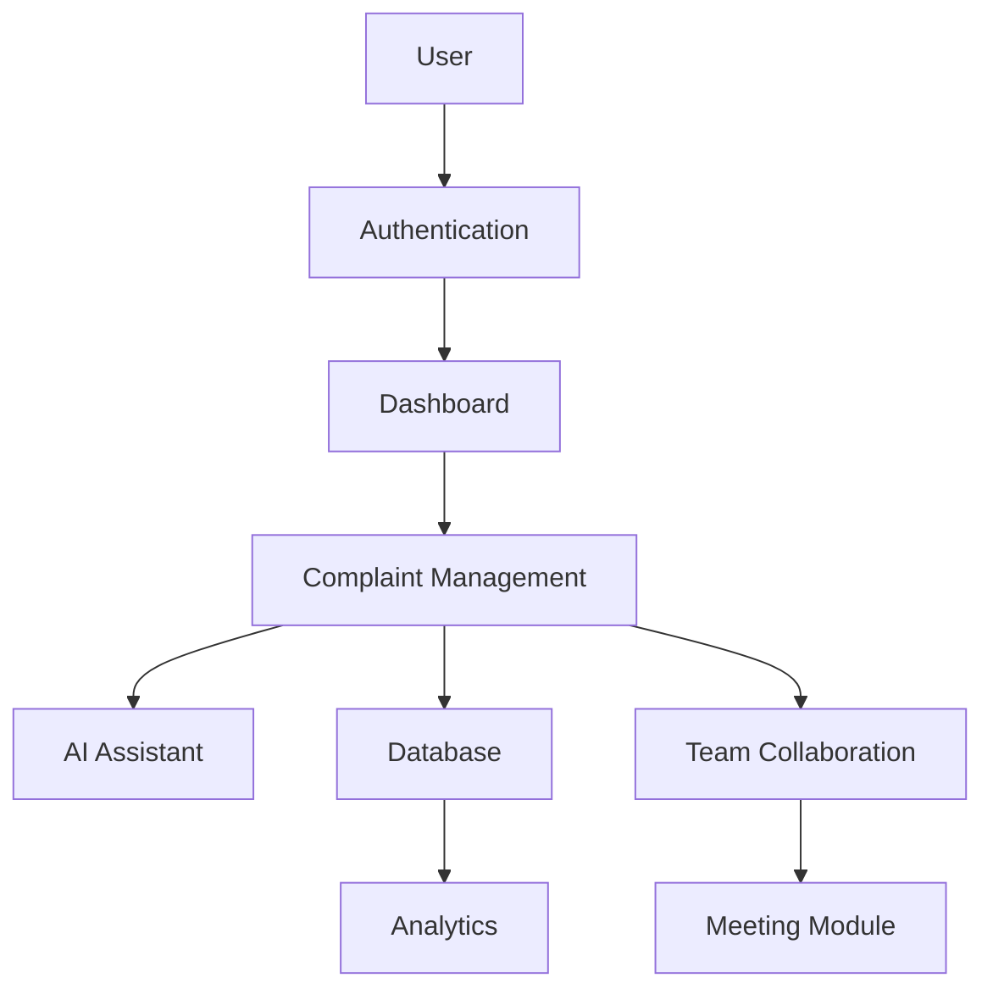

# 🚀 AI-Powered Digital Complaint Management System

> An enterprise-grade AI-powered complaint management platform featuring intelligent ticket handling, AI assistant, analytics, real-time collaboration, simulated voice/video meetings, and workflow automation.

[](https://ai-powered-complaint-management-v2.vercel.app)
[](https://github.com/Kavitha0703/ai-powered-complaint-management-v2)

---

## 🌐 Overview

Welcome to the **AI-Powered Digital Complaint Management System (DCMS)** – a robust, enterprise-level platform engineered to revolutionize how organizations handle, track, and remediate customer and internal complaints.

By leveraging advanced Artificial Intelligence, this system automates complex workflows, provides real-time collaboration tools, and delivers actionable insights, ensuring that every issue is resolved with speed, precision, and complete transparency.

---

## ✨ Project Highlights

- 🤖 AI-powered complaint analysis
- 📊 Interactive analytics dashboard
- 💬 Real-time team collaboration
- 🎥 AI-powered voice & video meeting simulation
- 📝 Live captions & meeting transcripts
- 📈 SLA monitoring and workflow automation
- 🔐 Secure authentication
- 🌙 Modern responsive UI
- ⚡ Built with React, TypeScript, Vite & Firebase

---

## 🌐 Live Demo

Experience the application here:

**🔗 https://ai-powered-complaint-management-v2.vercel.app**

No installation required.

---

## 🌟 Features

| Feature | Description |
| :--- | :--- |
| **AI Complaint Assistant** | Intelligent chatbot for instant complaint intake and guidance. |
| **Complaint Management** | Centralized dashboard for full-lifecycle complaint tracking. |
| **Smart Ticket Routing** | Automated classification and assignment to appropriate departments. |
| **Admin Dashboard** | High-level overview for supervisors to monitor operational metrics. |
| **Analytics Dashboard** | Rich data visualization showing trends and SLA performance. |
| **Team Collaboration** | Real-time tools for internal communication during remediation. |
| **Internal Team Chat** | Secure, threaded chat channels for deep-dive investigations. |
| **AI Voice Calls** | Simulated voice communication for rapid remediation discussions. |
| **AI Video Meetings** | Integrated "War Room" video interface for critical incident management. |
| **Live Captions** | Real-time speech-to-text integration for accessibility and logging. |
| **Screen Sharing Simulation** | Ability to share system screens for visual troubleshooting. |
| **Meeting Recording** | Persistent audio/video archives for audit and review purposes. |
| **Complaint Tracking** | End-to-end status monitoring from submission to resolution. |
| **Role-based Auth** | Secure access control restricting data based on user clearance. |
| **Firebase Integration** | Seamless data persistence and authentication powered by Google Firebase. |
| **Notification System** | Proactive alerts for status changes, escalations, and reminders. |
| **Search & Filters** | Robust querying capabilities to find specific tickets or users. |
| **AI Report Generation** | Automated generation of comprehensive remediation summary reports. |
| **AI Summarization** | Intelligent extraction of key points from long conversation threads. |
| **Workflow Automation** | Automatic trigger of SLA reminders and escalation protocols. |

---

## 🛠 Technology Stack

| Category | Technology |
| :--- | :--- |
| **Frontend** | React 18, TypeScript, Tailwind CSS |
| **Backend** | Node.js, Express.js |
| **Database** | Firebase Firestore |
| **Authentication** | Firebase Authentication |
| **AI** | Google Gemini API (GenAI SDK) |
| **Hosting** | Google Cloud Run |
| **Build Tool** | Vite |
| **Language** | TypeScript |
| **State Management** | React Context API |

---

## 🏗 Project Architecture



---

## 🔄 Workflow

```text
User
   │
   ▼
Complaint Submitted
   │
   ▼
AI Classification
   │
   ▼
Smart Routing
   │
   ▼
Team Investigation
   │
   ▼
Voice / Video Collaboration
   │
   ▼
AI Summary
   │
   ▼
Resolution
   │
   ▼
Analytics Dashboard
```

---

## 📂 Folder Structure

```text
Digital-Complaint-Management-System/
├── public/
├── src/
│   ├── components/       # Reusable UI components
│   ├── pages/            # Application routes/pages
│   ├── hooks/            # Custom React hooks
│   ├── services/         # API and third-party services
│   ├── utils/            # Helper functions
│   ├── lib/              # Core business logic / Context
│   └── types.ts          # Global TypeScript definitions
├── package.json
├── package-lock.json
├── tsconfig.json
├── vite.config.ts
├── README.md
└── .gitignore
```

---

## 🤖 AI Features

*   **Complaint Analysis:** Automatically parses incoming text to identify core issues.
*   **Smart Suggestions:** Provides suggested responses based on similar past issues.
*   **Meeting Summaries:** Extracts action items and key decisions from meeting transcripts.
*   **Report Generation:** Creates structured PDFs of remediation actions.
*   **Complaint Classification:** Uses NLP to map complaints to specific departments.
*   **Automatic Prioritization:** Ranks complaints based on urgency and SLA impact.

---

## 🤝 Team Collaboration

*   **Internal Team Chat:** Real-time messaging with mention support and attachments.
*   **Voice Calls:** Low-latency voice simulations for quick check-ins.
*   **Video Meetings:** Secure, browser-based video war-rooms.
*   **Captions:** Real-time transcription for meeting inclusivity.
*   **Meeting Recording:** Safe storage of sessions for future review.
*   **Screen Sharing:** High-fidelity screen transmission for collaborative diagnosis.

---

## 📈 Project Goals

The objective of this project is to modernize complaint management by combining AI, automation, analytics, and collaboration into a single enterprise platform.

The system is designed to reduce complaint resolution time, improve operational efficiency, and provide administrators with intelligent decision-making tools.

---

## 🏆 Learning Outcomes

During the development of this project I explored:

• Enterprise UI Design
• React + TypeScript Development
• Firebase Authentication
• AI Integration using Gemini
• Role-Based Access Control
• Dashboard Development
• Real-time Collaboration
• State Management
• Workflow Automation
• Modern Software Architecture

---

## 🚀 Future Enhancements

1. Add support for international languages.
2. Implement native mobile application (React Native).
3. Enhance analytics with predictive failure modeling.
4. Add integration with Jira/Slack.
5. Implement voice-controlled UI navigation.
6. Add automated end-to-end testing suite (Playwright).
7. Integrate real-time push notifications.
8. Implement customizable dashboard widgets.
9. Add dark/light theme toggle.
10. Implement advanced user permission profiles.
11. Add export functionality for all complaint reports (PDF/Excel).
12. Integrate advanced file previewer for large logs.
13. Implement AI-based anomaly detection in complaint volume.
14. Add collaborative real-time editor for technical docs.
15. Implement multi-factor authentication.
16. Add detailed user activity heatmaps.
17. Implement automated recurring ticket triggers.
18. Add support for third-party OAuth providers (GitHub/Google).
19. Implement client-side data caching for offline access.
20. Add robust logging and error monitoring (Sentry).

---

## 📊 Project Statistics

*   ✨ **Responsive UI:** Fluid design for all devices.
*   ⚡ **Real-time updates:** WebSocket-backed data streams.
*   🏢 **Enterprise Design:** Clean, accessible, and high-contrast.
*   🤖 **AI Automation:** End-to-end intelligent remediation.
*   📈 **Modern Dashboard:** High-performance, data-rich overview.
*   🌓 **Dark Theme:** Optimized for focus and reduced eye strain.
*   📊 **Interactive Charts:** Data-driven operational insights.
*   🔐 **Role-based Access:** Fine-grained security controls.

---

## 🎯 Why This Project

In a corporate landscape dominated by disconnected tools and manual processes, this Digital Complaint Management System acts as a **unified source of truth**. It reduces mean-time-to-resolution (MTTR), improves team cohesion through integrated communication, and utilizes AI to offload cognitive burden from agents, allowing them to focus on complex problem-solving rather than administrative overhead.

---

## 📸 Preview

Project screenshots and demo GIFs will be added after the final UI release.

---

## ⭐ Support

If you found this project useful, please consider:

- ⭐ Starring this repository
- 🍴 Forking the project
- 🐛 Reporting bugs
- 💡 Suggesting new features

---

## 📜 License

MIT

---

## 👨💻 Developer

Developed as a full-stack AI project demonstrating modern enterprise complaint management, intelligent workflow automation, and collaborative communication systems.

This project is continuously being improved with new AI-powered features and enterprise-grade functionality.

---
*Built with passion and ☕.*
